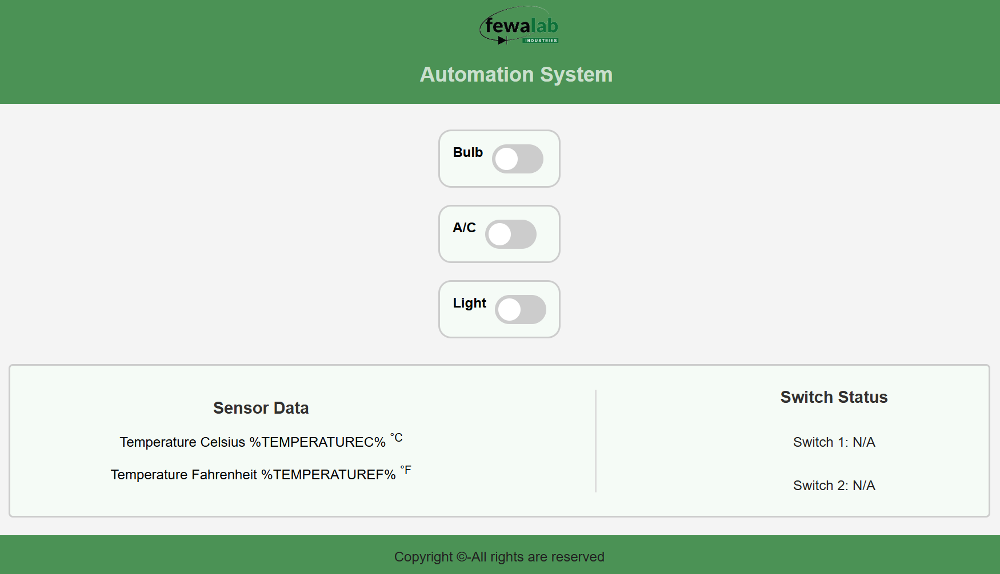

# ESP32 IOT Relay

This is a generic IOT Board based on ESP32 which can be programmed for industrial and home automation. It consists of three relays, built in ac-dc converter and fuse for protection of the board.

Features
- Control AC, bulb, and light using relays.
- Display temperature from DS18B20 sensor.
- Display statuses of two switches.
- Web interface for easy control and monitoring.

Hardware Required
- ESP32 development board
- 3-relay module
- DS18B20 temperature sensor
- Two switches
- Connecting wires
- Power supply

Software Required
- Arduino IDE
- LittleFS plugin for Arduino IDE
- Arduino libraries:
  - `WiFi`
  - `ESPAsyncWebServer`
  - `LittleFS`
  - `OneWire`
  - `DallasTemperature`

Installation
Arduino Setup
1. Install Libraries:
   - Open the Arduino IDE.
   - Go to `Sketch` > `Include Library` > `Manage Libraries`.
   - Search for and install the following libraries:
     - `OneWire`
     - `DallasTemperature`
     - `LittleFS`
   
2. Upload Files to ESP32:
   - Install the LittleFS plugin for the Arduino IDE if you haven’t already.
   - You can install the library following this tutorial: https://randomnerdtutorials.com/esp32-littlefs-arduino-ide/
   - Create a folder named `data` in your sketch directory.
   - Place `index.html`, `style.css`, and `jquery-3.7.0.min.js` in the `data` folder.
   - Upload the files to the ESP32 by selecting `Tools` > `ESP32 LittleFS Data    Upload`.

3. Configure WiFi Credentials:
   - Modify the `ssid` and `password` variables in the Arduino sketch to match your WiFi network.

4. Upload the Arduino Sketch:
   - Open the `.ino` file in the Arduino IDE.
   - Upload the sketch to the ESP32.

Web Interface
1. Connect the ESP32 to your WiFi network.
2. Open a web browser and enter the IP address of your ESP32 (check the Serial Monitor for the IP address after connecting to WiFi).
3. The web interface will display controls for the AC, bulb, and light, as well as temperature readings and switch statuses.

Controls
- Use the toggle switches on the web interface to turn the AC, bulb, and light on or off.
- The temperature sensor data and switch statuses will be updated automatically on the web interface.

This documentation provides a complete overview of the IOT based home automation system, including the necessary hardware and software, installation instructions, and usage guidelines. Feel free to customize and expand this documentation as needed for your project.
