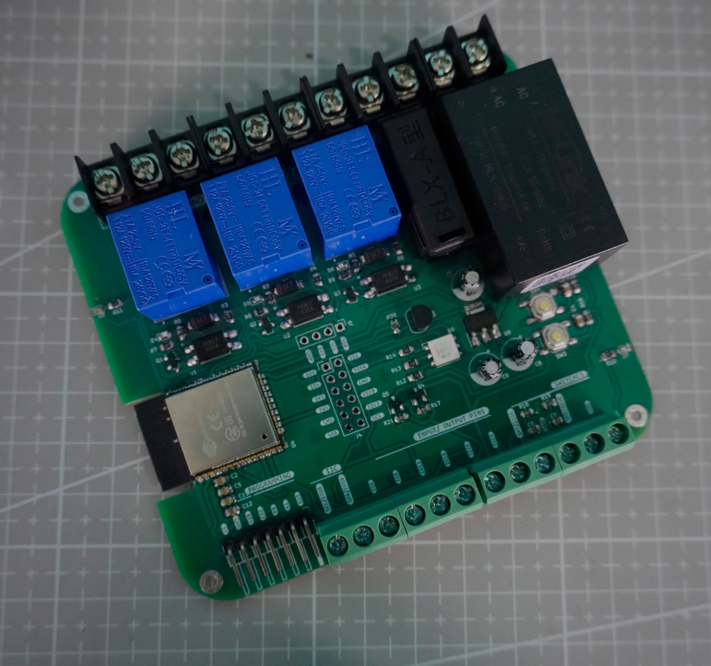

# ESP32 IOT Relay

This is a generic IOT Board based on ESP32 which can be programmed for industrial and home automation. It consists of three relays, built in ac-dc converter and fuse for protection of the board.